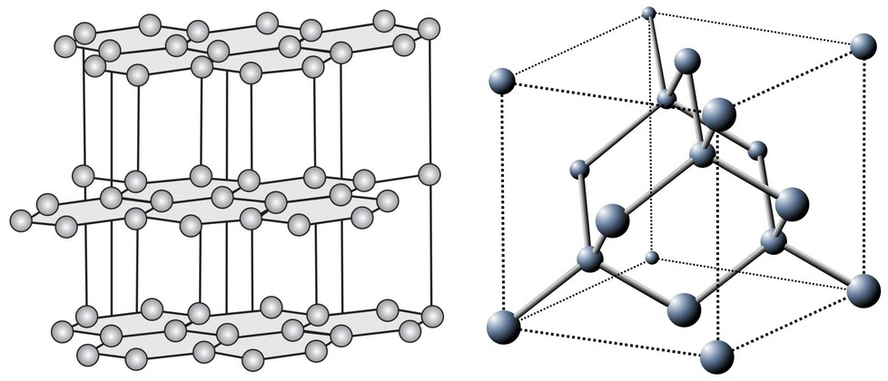
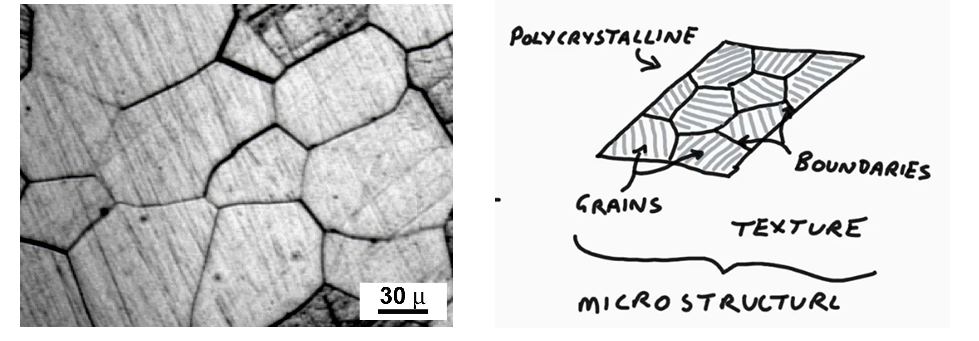

# بخش ۱ ـ تصویر کلی علم مواد

در این بخش می خواهیم یک تصویر کلی از علم مواد ارائه کنیم؛ به‌گونه‌ای که خوانندهٔ دارای زمینهٔ علوم کامپیوتر بتواند بفهمد داده‌های مواد دقیقاً دربارهٔ چه چیزی صحبت می‌کنند. در این بخش وارد جزئیات تخصصی کریستالوگرافی، ترمودینامیک یا مکانیک مواد نمی‌شویم. تمرکز اصلی روی این است که ماده فقط یک فرمول شیمیایی یا یک آرایهٔ عددی نیست، بلکه ساختاری چندمقیاسی دارد و همین ساختار، رفتار و خواص آن را تعیین می‌کند.

در پایان این بخش باید بتوانید:

1. رابطهٔ میان فرایند ساخت، ساختار، خواص و عملکرد ماده را توضیح دهید.
2. تفاوت ماده، فاز، کریستال و ریزساختار را تشخیص دهید.
3. بفهمید چرا دو ماده با ترکیب شیمیایی مشابه می‌توانند خواص متفاوتی داشته باشند.
4. مقیاس‌های مختلف ساختار ماده را از اتم تا قطعهٔ مهندسی نام ببرید.
5. توضیح دهید چرا داده‌های مواد در یادگیری ماشین معمولاً چندمقیاسی، ساختاریافته و مقید هستند.

## ۱.۱ علم مواد چه چیزی را مطالعه می‌کند؟

**علم مواد حوزه‌ای است که رابطهٔ میان ساختار ماده، روش ساخت آن، خواص آن و عملکرد نهایی آن را مطالعه می‌کند.** هدف این حوزه فقط توصیف مواد موجود نیست، بلکه فهم این است که چرا یک ماده رفتار خاصی دارد و چگونه می‌توان ماده‌ای با رفتار مطلوب طراحی یا تولید کرد.

یک زنجیرهٔ بسیار مهم در علم مواد به‌صورت زیر بیان می‌شود:

```text
عملکرد → خواص → ساختار → فرایند ساخت
```

یا به زبان انگلیسی:

```text
Processing → Structure → Properties → Performance
```

این زنجیره یعنی روش ساخت ماده روی ساختار داخلی آن اثر می‌گذارد؛ ساختار داخلی، خواص ماده را تعیین می‌کند؛ و خواص ماده، عملکرد آن در کاربرد واقعی را مشخص می‌سازد.

برای مثال، اگر یک فلز سریع سرد شود، ممکن است ساختار داخلی متفاوتی نسبت به زمانی داشته باشد که آهسته سرد شده است. همین تفاوت ساختاری می‌تواند باعث شود یکی سخت‌تر، شکننده‌تر یا مقاوم‌تر باشد. بنابراین، در علم مواد فقط دانستن «چه اتم‌هایی وجود دارند» کافی نیست؛ باید بدانیم آن اتم‌ها چگونه سازمان یافته‌اند.

## ۱.۲ چرا ساختار مهم‌تر از چیزی است که در نگاه اول به نظر می‌رسد؟

در نگاه ساده، ممکن است تصور شود که خواص ماده فقط به ترکیب شیمیایی آن بستگی دارد. مثلاً اگر بدانیم یک ماده از کربن، آهن یا سیلیسیم تشکیل شده است، شاید فکر کنیم رفتار آن را هم می‌توان حدس زد. اما در عمل، **نحوهٔ آرایش اتم‌ها و سازمان ماده در مقیاس‌های مختلف** نقش تعیین‌کننده دارد.

یک مثال کلاسیک، **الماس و گرافیت** است. هر دو تقریباً از اتم‌های کربن تشکیل شده‌اند، اما آرایش اتم‌ها در آن‌ها کاملاً متفاوت است. در الماس، اتم‌های کربن یک شبکهٔ سه‌بعدی بسیار محکم می‌سازند؛ در حالی‌که در گرافیت، اتم‌ها در لایه‌های دوبعدی قرار گرفته‌اند و اتصال میان لایه‌ها ضعیف‌تر است. به همین دلیل، الماس بسیار سخت است، اما گرافیت نرم‌تر است و می‌تواند در مغز مداد استفاده شود.


*ساختارهای بلوری گرافیت (چپ) و الماس (راست).*

نمونهٔ دیگر، فولادهایی با ترکیب شیمیایی مشابه اما ریزساختار متفاوت هستند. دو نمونهٔ فولاد ممکن است از نظر ترکیب نزدیک باشند، اما اگر یکی دانه‌های ریزتر یا فازهای متفاوت‌تری داشته باشد، استحکام و شکل‌پذیری آن می‌تواند کاملاً متفاوت باشد.

پس یک اصل مهم در علم مواد این است:

```text
ترکیب شیمیایی مهم است، اما به‌تنهایی کافی نیست؛ ساختار ماده نیز تعیین‌کننده است.
```

## ۱.۳ چهار مفهوم پایه: ماده، فاز، کریستال، ریزساختار

برای فهم داده‌ها و مدل‌های علم مواد، باید چهار مفهوم را از هم جدا کرد:

1. ماده
2. فاز
3. کریستال
4. ریزساختار

این مفاهیم به هم مرتبط‌اند، اما یکی نیستند. اشتباه گرفتن آن‌ها باعث می‌شود بسیاری از متن‌های علم مواد مبهم یا گیج‌کننده به نظر برسند.

## ۱.۴ ماده چیست؟

**ماده یک سیستم فیزیکی است که از اتم‌ها تشکیل شده و می‌تواند ساختار، خواص و رفتار مشخصی داشته باشد.** ماده می‌تواند فلز، سرامیک، پلیمر، نیمه‌رسانا یا ترکیبی از این‌ها باشد.

برای مثال:

- آهن یک ماده است.
- سیلیکون یک ماده است.
- شیشه یک ماده است.
- آلیاژ آلومینیوم یک ماده است.
- فولاد یک خانوادهٔ بسیار گسترده از مواد است.

اما ماده فقط یک ترکیب شیمیایی نیست. برای توصیف دقیق ماده، باید بدانیم:

- چه اتم‌هایی در آن وجود دارند؛
- این اتم‌ها چگونه کنار هم قرار گرفته‌اند؛
- آیا ماده کریستالی است یا آمورف؛
- چه فازهایی در آن وجود دارند؛
- دانه‌ها چه اندازه و شکلی دارند؛
- مرزهای داخلی ماده چگونه سازمان یافته‌اند.

از دید داده‌ای، یک ماده می‌تواند با ترکیبی از اطلاعات شیمیایی، ساختاری، هندسی و فیزیکی نمایش داده شود.

## ۱.۵ فاز چیست؟

**فاز ناحیه‌ای از ماده است که ترکیب، ساختار و خواص نسبتاً یکنواختی دارد.** در مواد جامد، فازها ممکن است از نظر ترکیب شیمیایی، ساختار بلوری یا خواص فیزیکی با هم متفاوت باشند.

برای مثال، یک مادهٔ چندفازی ممکن است شامل دو فاز باشد:

- یک فاز سخت‌تر؛
- یک فاز نرم‌تر؛
- یا دو فاز با ساختار بلوری متفاوت.

در یک تصویر ریزساختاری، فاز معمولاً به‌صورت یک نقشهٔ فضایی دیده می‌شود؛ یعنی هر ناحیه از تصویر به یک فاز خاص تعلق دارد. چنین نقشه‌ای را می‌توان شبیه یک تصویر برچسب‌خورده در بینایی ماشین در نظر گرفت، با این تفاوت که برچسب‌ها معنای فیزیکی دارند.

فاز برای مدل‌سازی مواد مهم است، زیرا بسیاری از خواص ماده به مقدار، شکل و توزیع فازها بستگی دارد. دو ماده با درصد فازهای متفاوت یا با توزیع فضایی متفاوت فازها می‌توانند رفتار کاملاً متفاوتی نشان دهند.

## ۱.۶ کریستال چیست؟

**کریستال ماده‌ای است که اتم‌های آن در یک الگوی منظم و تکرارشونده قرار گرفته‌اند.** این نظم در فضا باعث می‌شود بتوان ساختار کریستال را با مفاهیمی مانند **شبکهٔ بلوری** و **سلول واحد** توصیف کرد.

یک کریستال ایده‌آل را می‌توان به‌صورت تکرار بی‌نهایت یک الگوی کوچک در سه جهت فضایی تصور کرد. این الگوی کوچک همان سلول واحد است. با تکرار این سلول در فضا، کل ساختار کریستالی ساخته می‌شود.

به زبان ساده:

```text
کریستال = الگوی اتمی تکرارشونده در فضا
```

کریستال‌ها معمولاً با اطلاعاتی مانند موارد زیر توصیف می‌شوند:

- نوع اتم‌ها؛
- موقعیت اتم‌ها؛
- بردارهای شبکه؛
- سلول واحد؛
- تقارن‌های ساختار؛
- گروه فضایی.

در مدل‌سازی محاسباتی، یک کریستال اغلب به‌صورت ترکیبی از شبکه، مختصات اتمی و نوع اتم‌ها نمایش داده می‌شود.

## ۱.۷ آمورف چیست؟

همهٔ مواد جامد کریستالی نیستند. در مواد **آمورف**، اتم‌ها الگوی تکرارشوندهٔ سراسری تشکیل نمی‌دهند. ممکن است در مقیاس کوتاه، نظم محلی وجود داشته باشد، اما اگر در فاصله‌های بزرگ‌تر حرکت کنیم، الگوی تناوبی مشخصی دیده نمی‌شود.

مثال آشنا، شیشه است. شیشه جامد است، اما اتم‌های آن مانند کریستال در یک شبکهٔ تناوبی منظم قرار نگرفته‌اند.

مقایسهٔ ساده:

```text
کریستال: الگوی منظم و تکرارشونده در مقیاس بزرگ
آمورف: بدون الگوی تکرارشوندهٔ سراسری
```

از دید مدل‌سازی داده، تفاوت میان کریستال و آمورف مهم است؛ زیرا نمایش، معیار فاصله، تقارن و قیود فیزیکی آن‌ها می‌تواند متفاوت باشد.

## ۱.۸ ریزساختار چیست؟

**ریزساختار توصیف سازمان ماده در مقیاسی بزرگ‌تر از اتم‌ها و کوچک‌تر از قطعهٔ مهندسی است.** ریزساختار معمولاً با میکروسکوپ یا ابزارهای مشخصه‌یابی مشاهده می‌شود و شامل ویژگی‌هایی است که به‌طور مستقیم روی خواص ماده اثر می‌گذارند.



ریزساختار می‌تواند شامل موارد زیر باشد:

- دانه‌ها؛
- فازها؛
- مرزهای دانه؛
- شکل و اندازهٔ دانه‌ها؛
- توزیع فضایی فازها؛
- جهت‌گیری بلوری دانه‌ها؛
- حفره‌ها، ترک‌ها یا ناخالصی‌ها.

در بسیاری از مواد، خواص نهایی فقط به ترکیب شیمیایی وابسته نیست، بلکه به ریزساختار نیز بستگی دارد. مثلاً اندازهٔ دانه‌ها می‌تواند روی استحکام ماده اثر بگذارد. به‌طور کلی، ریزدانه‌تر شدن بسیاری از فلزات می‌تواند باعث افزایش استحکام شود، هرچند جزئیات آن به نوع ماده و شرایط فرایند بستگی دارد.

از دید کامپیوتری، ریزساختار را می‌توان به‌صورت تصویر، گراف، نقشهٔ برچسب، میدان جهت‌گیری یا آرایهٔ چندکاناله نمایش داد.

## ۱.۹ دانه چیست؟

در بسیاری از مواد کریستالی واقعی، کل ماده از یک کریستال بزرگ واحد تشکیل نشده است. در عوض، ماده از تعداد زیادی ناحیهٔ کریستالی کوچک‌تر تشکیل می‌شود که به هرکدام **دانه** (Grain) گفته می‌شود.

هر دانه خودش یک ناحیهٔ کریستالی است، اما جهت‌گیری بلوری آن ممکن است با دانهٔ کناری متفاوت باشد. به مرز میان دو دانه، **مرز دانه** گفته می‌شود.

یک مادهٔ دارای چندین دانه را **پلی‌کریستال** می‌نامند.

```text
پلی‌کریستال = مجموعه‌ای از دانه‌های کریستالی با جهت‌گیری‌های مختلف
```

دانه‌ها از نظر علم مواد مهم‌اند، چون اندازه، شکل، جهت‌گیری و نحوهٔ اتصال آن‌ها به یکدیگر می‌تواند خواص مکانیکی، حرارتی و الکتریکی ماده را تغییر دهد.


## ۱.۱۰ مقیاس‌های مختلف در مواد

علم مواد ذاتاً چندمقیاسی است. یک ماده را می‌توان در چند سطح مختلف بررسی کرد، و هر سطح اطلاعات خاص خود را دارد.

### مقیاس اتمی

در این مقیاس، با موقعیت تک‌تک اتم‌ها سروکار داریم.

اطلاعات مهم در این سطح:

- نوع اتم‌ها؛
- مختصات اتمی؛
- فاصلهٔ بین اتم‌ها؛
- پیوندهای محلی؛
- شبکهٔ بلوری.

### مقیاس کریستالی

در این سطح، به نظم تناوبی اتم‌ها توجه می‌کنیم. مفاهیمی مانند سلول واحد، شبکهٔ بلوری، تقارن و گروه فضایی در این مقیاس مطرح می‌شوند.

### مقیاس دانه

در این مقیاس، هر دانه به‌عنوان یک ناحیهٔ کریستالی با جهت‌گیری خاص خود بررسی می‌شود.

اطلاعات مهم در این سطح:

- شکل دانه؛
- اندازهٔ دانه؛
- جهت‌گیری دانه؛
- فاز دانه؛
- دانه‌های همسایه.

### مقیاس ریزساختار

در این مقیاس، سازمان کلی دانه‌ها، فازها و مرزها بررسی می‌شود. این سطح برای فهم بسیاری از خواص مهندسی ماده حیاتی است.

### مقیاس قطعهٔ مهندسی

در این مقیاس، ماده به‌عنوان یک قطعه یا نمونهٔ کامل بررسی می‌شود. خواصی مانند استحکام، رسانایی، شکل‌پذیری، مقاومت به شکست یا دوام در این سطح اهمیت دارند.

## ۱.۱۱ چرا مواد برای یادگیری ماشین چالش‌برانگیز هستند؟

داده‌های مواد از چند جهت برای یادگیری ماشین چالش‌برانگیز هستند.

اول، داده‌ها معمولاً چندمقیاسی هستند. اطلاعات اتمی، کریستالی، ریزساختاری و ماکروسکوپی می‌توانند هم‌زمان مهم باشند.

دوم، نمایش‌ها همیشه یکتا نیستند. یک کریستال ممکن است با چند سلول واحد متفاوت نمایش داده شود، یا دو مختصات متفاوت ممکن است تحت شرایط تناوبی به یک موقعیت فیزیکی یکسان اشاره کنند.

سوم، بسیاری از قیود فیزیکی باید رعایت شوند. یک خروجی تولیدشده ممکن است از نظر عددی قابل قبول به نظر برسد، اما اگر فاصلهٔ بین اتم‌ها نامعتبر باشد یا با فاز مورد نظر سازگار نباشد، از نظر علم مواد پذیرفتنی نیست.

چهارم، داده‌های مواد اغلب کم‌حجم، گران، ناهمگون یا نویزی هستند. تولید دادهٔ تجربی یا شبیه‌سازی دقیق می‌تواند پرهزینه باشد.

بنابراین، مدل‌سازی یادگیری ماشین در علم مواد فقط مسئلهٔ پیدا کردن یک معماری قوی نیست؛ بلکه نیازمند فهم معنای فیزیکی داده‌ها، قیود و نمایش‌هاست.

## ۱.۱۲ جایگاه یادگیری ماشین در علم مواد

یادگیری ماشین در علم مواد برای اهداف مختلفی استفاده می‌شود، از جمله:

1. پیش‌بینی خواص مواد

[Crystal Graph Convolutional Neural Networks for an Accurate and Interpretable Prediction of Material Properties](https://arxiv.org/abs/1710.10324)

2. کشف مواد جدید:

[Scaling Deep Learning for Materials Discovery](https://www.nature.com/articles/s41586-023-06735-9)

3. بازسازی ریزساختار:

[Stochastic Reconstruction of an Oolitic Limestone by Generative Adversarial Networks](https://arxiv.org/abs/1712.02854)

4. طراحی معکوس مواد:

[Generative Deep Learning for the Inverse Design of Materials](https://arxiv.org/abs/2409.19124)

5. تولید ساختارهای اتمی یا ریزساختاری: 

[Crystal Diffusion Variational Autoencoder for Periodic Material Generation](https://arxiv.org/abs/2110.06197)

6. تحلیل داده‌های تصویری و تجربی: 

[Deep-Learning-Based Image Segmentation Integrated with Optical Microscopy for Automatically Searching for Two-Dimensional Materials](https://arxiv.org/abs/1910.12750)

7. کاهش هزینهٔ شبیه‌سازی و آزمایش: 

[A Universal Graph Deep Learning Interatomic Potential for the Periodic Table](https://arxiv.org/abs/2202.02450)

در سال‌های اخیر، مدل‌های مولد نیز در این حوزه اهمیت زیادی پیدا کرده‌اند. این مدل‌ها می‌توانند توزیع داده‌های مواد را یاد بگیرند و نمونه‌های جدید پیشنهاد دهند. اما در علم مواد، تولید نمونهٔ جدید به‌تنهایی کافی نیست. نمونهٔ تولیدشده باید از نظر هندسی، شیمیایی، تقارنی و فیزیکی معتبر باشد.

## ۱.۱۳ نگاه کامپیوتری و نگاه علم مواد

از دید کامپیوتر، ممکن است یک ساختار فقط یک آرایهٔ عددی، تصویر، گراف یا مجموعه‌ای از مختصات باشد. اما از دید علم مواد، همان داده باید معنای فیزیکی داشته باشد.

برای مثال:

- دو آرایهٔ عددی متفاوت ممکن است یک کریستال فیزیکی یکسان را نمایش دهند.
- دو اتم ممکن است در مختصات خام دور به نظر برسند، اما تحت شرایط تناوبی نزدیک باشند.
- یک تصویر ریزساختاری فقط یک تصویر نیست؛ هر ناحیهٔ آن می‌تواند نشان‌دهندهٔ فاز، دانه یا جهت‌گیری خاصی باشد.
- یک خروجی ممکن است از نظر آماری شبیه داده باشد، اما از نظر فاصلهٔ بین اتمی یا سازگاری فازی نامعتبر باشد.

بنابراین، در کار با داده‌های مواد باید میان «نمایش عددی» و «معنای فیزیکی» تفاوت قائل شد.

## ۱.۱۴ نکات کلیدی

نکات کلیدی این بخش:

1. علم مواد رابطهٔ میان فرایند ساخت، ساختار، خواص و عملکرد را مطالعه می‌کند.
2. ماده فقط با نوع اتم‌ها تعریف نمی‌شود؛ نحوهٔ سازمان‌یافتگی آن‌ها نیز مهم است.
3. فاز، کریستال، دانه و ریزساختار مفاهیم متفاوت اما مرتبط‌اند.
4. کریستال‌ها دارای نظم تناوبی هستند، اما مواد آمورف نظم تناوبی سراسری ندارند.
5. ریزساختار سازمان ماده در مقیاس دانه‌ها، فازها و مرزهاست.
6. داده‌های مواد معمولاً چندمقیاسی، ساختاریافته و مقید هستند.
7. برای یادگیری ماشین در علم مواد، فهم معنای فیزیکی نمایش‌ها به‌اندازهٔ خود مدل مهم است.
