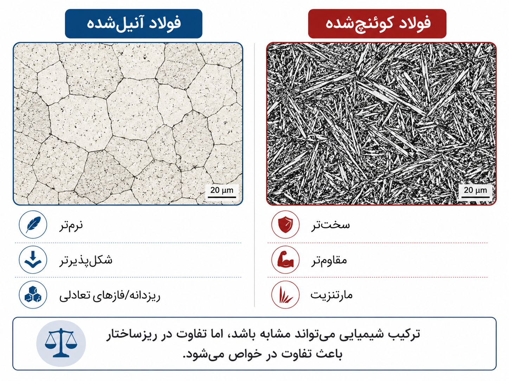

# بخش ۲ — ساختار اتمی و کریستالی

در این بخش با مفاهیم پایه‌ای ساختار اتمی و کریستالی آشنا می‌شویم. هدف این نیست که وارد همهٔ جزئیات تخصصی بلورشناسی شویم، بلکه می‌خواهیم بفهمیم یک ساختار بلوری چگونه توصیف می‌شود، چرا نمایش آن یکتا نیست، و چرا مفاهیمی مانند شبکه، سلول واحد، مختصات کسری و تناوب برای مدل‌سازی محاسباتی مواد ضروری هستند.

پس از پایان این بخش باید بتوانید:

1. تفاوت مادهٔ کریستالی و آمورف را توضیح دهید.
2. مفهوم شبکهٔ بلوری و سلول واحد را بفهمید.
3. تفاوت مختصات کارتزین و مختصات کسری را بیان کنید.
4. دلیل استفاده از شرایط مرزی تناوبی در کریستال‌ها را توضیح دهید.
5. یک ساختار بلوری ساده را به‌صورت $(L,F,A)$ نمایش دهید.

## ۲.۱ ماده از دیدگاه اتمی

هر ماده از اتم‌ها یا یون‌هایی تشکیل شده است که در فضا آرایش پیدا کرده‌اند. نوع اتم‌ها مهم است، اما کافی نیست. خواص ماده فقط به این وابسته نیست که چه اتم‌هایی در آن وجود دارند، بلکه به این نیز وابسته است که این اتم‌ها چگونه کنار هم قرار گرفته‌اند.

برای مثال، فولاد آنیل‌شده و فولاد کوئنچ‌شده می‌توانند ترکیب شیمیایی بسیار نزدیکی داشته باشند، اما به دلیل تفاوت در ریزساختار، خواص مکانیکی متفاوتی نشان دهند. در فولاد آنیل‌شده، ساختار معمولاً نرم‌تر و شکل‌پذیرتر است، در حالی که در فولاد کوئنچ‌شده، تشکیل فازهایی مانند مارتنزیت می‌تواند سختی و استحکام را به‌طور قابل توجهی افزایش دهد. این مثال نشان می‌دهد که خواص ماده فقط به ترکیب شیمیایی وابسته نیست، بلکه به تاریخچهٔ فرایند و ساختار داخلی نیز بستگی دارد.



این ایده یکی از اصول مرکزی علم مواد است:

> ساختار ماده تعیین‌کنندهٔ بخش مهمی از خواص آن است.

## ۲.۲ مادهٔ کریستالی و مادهٔ آمورف

از نظر آرایش اتمی، جامدات را می‌توان به دو دستهٔ مهم **کریستالی** و **آمورف** تقسیم کرد. در مادهٔ کریستالی، اتم‌ها با یک الگوی منظم و تکرارشونده در فضا قرار گرفته‌اند. این الگو در فواصل بزرگ نیز ادامه دارد. به این نوع نظم، **نظم تناوبی بلندبرد** گفته می‌شود.

در مادهٔ آمورف، اتم‌ها ممکن است در فاصله‌های کوتاه تا حدی منظم باشند، اما در مقیاس‌های بزرگ الگوی تکرارشوندهٔ منظم ندارند. شیشه نمونه‌ای رایج از مادهٔ آمورف است.

به بیان ساده‌تر:

- کریستال شبیه الگویی است که یک کاشی کوچک بارها در فضا تکرار شده است.
- مادهٔ آمورف شبیه ساختاری است که در نزدیکی هر نقطه نظم محدودی دارد، اما الگوی سراسری و تکرارشونده ندارد.

## ۲.۳ کریستال چیست؟

یک **کریستال** جامدی است که در آن اتم‌ها بر اساس الگویی منظم و تناوبی در فضا چیده شده‌اند. این الگوی تکرارشونده را می‌توان با دو مفهوم توصیف کرد:

1. **شبکهٔ بلوری** یا lattice
2. **پایه** یا basis

شبکهٔ بلوری، چارچوب هندسی تکرارشونده را مشخص می‌کند. پایه مشخص می‌کند که در هر نقطه از این شبکه، چه اتم‌هایی قرار می‌گیرند.

```text
Crystal = Lattice + Basis
```

یعنی:

```text
کریستال = شبکهٔ تکرارشونده + اتم‌هایی که روی آن شبکه قرار می‌گیرند
```

## ۲.۴ شبکهٔ بلوری

شبکهٔ بلوری مجموعه‌ای از نقاط در فضاست که با انتقال‌های منظم از یکدیگر به دست می‌آیند. در سه‌بعد، یک شبکه را می‌توان با سه بردار مستقل توصیف کرد:

$$
\mathbf{a}_1,\mathbf{a}_2,\mathbf{a}_3
$$

هر نقطهٔ شبکه را می‌توان به‌صورت ترکیب صحیحی از این سه بردار نوشت:

$$
\mathbf{r}
=
n_1\mathbf{a}_1
+
n_2\mathbf{a}_2
+
n_3\mathbf{a}_3,
\qquad
n_1,n_2,n_3 \in \mathbb{Z}.
$$

در این رابطه:

- بردار $\mathbf{r}$ موقعیت یک نقطهٔ شبکه است.
- بردارهای $ \mathbf{a}_1,\mathbf{a}_2,\mathbf{a}_3 $ بردارهای پایهٔ شبکه هستند.
- مقادیر $n_1,n_2,n_3$ اعداد صحیح‌اند.
- مجموعه $\mathbb{Z}$ مجموعهٔ اعداد صحیح است.

این فرمول می‌گوید که با حرکت به اندازه‌های صحیح از سه بردار اصلی، می‌توان تمام نقاط شبکه را ساخت.

## ۲.۵ سلول واحد

برای توصیف یک کریستال، لازم نیست تمام اتم‌های آن را یکی‌یکی بنویسیم. کافی است کوچک‌ترین واحد تکرارشوندهٔ ساختار را مشخص کنیم. به این واحد، **سلول واحد** (Unit Cell) گفته می‌شود.

سلول واحد حجمی از فضاست که با تکرار آن در سه جهت، کل کریستال ساخته می‌شود.

یک سلول واحد با شش پارامتر توصیف می‌شود:

$$
a,b,c,\alpha,\beta,\gamma
$$

که در آن:

- مقادیر $a,b,c$ طول بردارهای شبکه هستند.
- مقادیر $\alpha,\beta,\gamma$ زاویه‌های میان این بردارها هستند.

این شش مقدار شکل و اندازهٔ سلول واحد را تعیین می‌کنند.

## ۲.۶ سلول اولیه و سلول متعارف

برای یک ساختار بلوری، معمولاً بیش از یک انتخاب برای سلول واحد وجود دارد. دو نوع رایج عبارت‌اند از:

1. **سلول اولیه** (primitive cell)
2. **سلول متعارف** (conventional cell)

سلول اولیه کوچک‌ترین سلولی است که با تکرار آن می‌توان کل شبکه را ساخت. سلول متعارف ممکن است بزرگ‌تر باشد، اما تقارن ساختار را واضح‌تر نشان می‌دهد.

این موضوع مهم است، زیرا یک کریستال واحد می‌تواند با چند سلول متفاوت نمایش داده شود. پس نمایش کریستال همیشه یکتا نیست. در مدل‌سازی محاسباتی، این نایکتایی می‌تواند مشکل‌ساز شود. دو فایل داده ممکن است از نظر عددی متفاوت باشند، اما در واقع یک ساختار فیزیکی یکسان را توصیف کنند.

## ۲.۷ سیستم‌های بلوری

بر اساس شکل سلول واحد و تقارن‌های آن، کریستال‌ها به هفت سیستم بلوری تقسیم می‌شوند:

1. مکعبی (Cubic)
2. تتراگونال (Tetragonal)
3. ارتورومبیک (Orthorhombic)
4. هگزاگونال (Hexagonal)
5. رومبوهدرال یا تریگونال (Rhombohedral / Trigonal)
6. مونوکلینیک (Monoclinic)
7. تریکلینیک (Triclinic)

این سیستم‌ها دسته‌بندی‌های هندسی کلی برای ساختارهای بلوری هستند. برای مثال، در سیستم مکعبی داریم:

$$
a=b=c,
\qquad
\alpha=\beta=\gamma=90^\circ.
$$

یعنی همهٔ طول‌ها برابرند و همهٔ زاویه‌ها قائمه هستند. در مقابل، در سیستم تریکلینیک هیچ الزام ساده‌ای برای برابر بودن طول‌ها یا زاویه‌ها وجود ندارد. بنابراین، سیستم تریکلینیک کمترین تقارن را دارد.

## ۲.۸ مختصات کارتزین

مختصات کارتزین همان مختصات معمول در فضای سه‌بعدی هستند:

$$
(x,y,z)
$$

در این دستگاه، موقعیت هر اتم با فاصلهٔ آن از محورهای $x$، $y$، و $z$ مشخص می‌شود.

مختصات کارتزین برای بسیاری از مسائل هندسی ساده و شهودی هستند، اما برای کریستال‌ها همیشه بهترین انتخاب نیستند. دلیل آن این است که کریستال‌ها با یک سلول واحد و تکرار تناوبی توصیف می‌شوند. در نتیجه، موقعیت اتم‌ها معمولاً بهتر است نسبت به بردارهای شبکه بیان شود.

## ۲.۹ مختصات کسری

در کریستال‌ها، موقعیت اتم‌ها اغلب با **مختصات کسری** توصیف می‌شود. مختصات کسری موقعیت اتم را نسبت به بردارهای سلول واحد بیان می‌کند. اگر بردارهای شبکه را در ماتریس $L$ قرار دهیم و مختصات کسری یک اتم را با $f$ نشان دهیم، مختصات کارتزین آن اتم به‌صورت زیر به دست می‌آید:

$$
r = Lf.
$$

در این رابطه:

- $f$ مختصات کسری است.
- $r$ مختصات کارتزین است.
- $L$ ماتریس شبکه است.

اگر:

$$
f=(0.5,0.5,0.5)
$$

باشد، یعنی اتم در مرکز سلول واحد قرار دارد، نه اینکه لزوماً مختصات کارتزین آن برابر با $(0.5,0.5,0.5)$ آنگستروم باشد.

## ۲.۱۰ چرا مختصات کسری مهم است؟

مختصات کسری برای کریستال‌ها طبیعی‌تر از مختصات کارتزین است، زیرا مستقیماً به سلول واحد و تناوب ساختار وابسته است. در مختصات کسری، هر مؤلفه معمولاً در بازهٔ زیر قرار می‌گیرد:

$$
[0,1)
$$

اما این بازه مانند یک بازهٔ معمولی رفتار نمی‌کند. اگر یک اتم از مرز سلول خارج شود، از سمت دیگر سلول وارد می‌شود. بنابراین:

$$
f \sim f+n,
\qquad
n \in \mathbb{Z}^3.
$$

این رابطه می‌گوید مختصات $f$ و $f+n$ یک موقعیت فیزیکی یکسان را نمایش می‌دهند، اگر $n$ یک بردار صحیح شبکه‌ای باشد.

## ۲.۱۱ تناوب و شرایط مرزی تناوبی

کریستال‌ها با تکرار یک سلول واحد در فضا ساخته می‌شوند. بنابراین، مرزهای سلول واحد مرزهای واقعی ماده نیستند. اگر اتمی از یک سمت سلول خارج شود، معادل آن است که از سمت دیگر وارد شود. به این ایده، **شرایط مرزی تناوبی** گفته می‌شود.

یک مثال ساده در یک بعد:

- نقطهٔ $0.99$ نزدیک انتهای بازه است.
- نقطهٔ $0.01$ نزدیک ابتدای بازه است.

در هندسهٔ معمولی، فاصلهٔ آن‌ها برابر است با:

$$
|0.99-0.01|=0.98.
$$

اما در هندسهٔ تناوبی، این دو نقطه نزدیک‌اند، چون یکی در انتهای سلول و دیگری در ابتدای همان سلول تکرارشونده قرار دارد. فاصلهٔ واقعی تناوبی آن‌ها برابر با $0.02$ است.

## ۲.۱۲ قرارداد کمینه‌تصویر

برای محاسبهٔ فاصله‌ها در یک سلول تناوبی، از **قرارداد کمینه‌تصویر** استفاده می‌شود. اگر $f_i$ و $f_j$ مختصات کسری دو اتم باشند، اختلاف تناوبی آن‌ها به‌صورت زیر محاسبه می‌شود:

$$
\Delta f_{ij}
=
\left((f_i-f_j)+\tfrac{1}{2}\right)\bmod 1-\tfrac{1}{2}.
$$

این فرمول اختلاف هر مؤلفه را به بازهٔ زیر منتقل می‌کند:

$$
[-\tfrac{1}{2},\tfrac{1}{2})
$$

در نتیجه، کوتاه‌ترین فاصلهٔ تناوبی میان دو موقعیت به دست می‌آید.

این موضوع برای مدل‌سازی مواد بسیار مهم است. اگر فاصله‌ها بدون در نظر گرفتن تناوب محاسبه شوند، ممکن است دو اتم که در دو سوی مرز سلول بسیار نزدیک‌اند، به‌اشتباه دور از هم در نظر گرفته شوند.

## ۲.۱۳ نمایش ساختار بلوری به‌صورت $(L,F,A)$

در بسیاری از روش‌های محاسباتی، یک ساختار بلوری را می‌توان به‌صورت زیر نمایش داد:

$$
C=(L,F,A).
$$

در این رابطه:

- بردار $L$ شبکه یا lattice است.
- ماتریس $F$ مجموعهٔ مختصات کسری اتم‌هاست.
- بردار $A$ گونه‌های اتمی یا نوع اتم‌هاست.

برای مثال، اگر یک ساختار شامل سه اتم باشد، می‌توان داشت:

$$
F=
\begin{bmatrix}
0 & 0 & 0\\
0.5 & 0.5 & 0\\
0.5 & 0 & 0.5
\end{bmatrix}
$$

و:

$$
A=(\mathrm{Si},\mathrm{Si},\mathrm{O}).
$$

در اینجا، $F$ موقعیت اتم‌ها را در مختصات کسری مشخص می‌کند و $A$ نوع اتم‌ها را نشان می‌دهد. این نمایش برای یادگیری ماشین مناسب است، زیرا ساختار را به سه بخش نسبتاً روشن تقسیم می‌کند: هندسهٔ سلول، موقعیت اتم‌ها، و نوع اتم‌ها.

## ۲.۱۴ چرا نمایش کریستال دشوار است؟

نمایش کریستال از چند جهت دشوار است:

1. **تناوب**: مختصات اتمی در یک سلول محدود نوشته می‌شوند، اما ساختار واقعی نامتناهی و تکرارشونده است.
2. **نایکتایی سلول واحد**: یک ساختار می‌تواند با سلول‌های متفاوت نمایش داده شود.
3. **تقارن**: چندین توصیف عددی ممکن است از نظر فیزیکی معادل باشند.
4. **تعداد متغیر اتم‌ها**: ساختارهای مختلف ممکن است تعداد اتم‌های متفاوتی در سلول داشته باشند.
5. **قیود فیزیکی**: همهٔ آرایش‌های عددی معتبر نیستند.

این نکات باعث می‌شوند که تولید یا مقایسهٔ ساختارهای بلوری با داده‌های معمولی مانند تصویر یا متن تفاوت جدی داشته باشد.